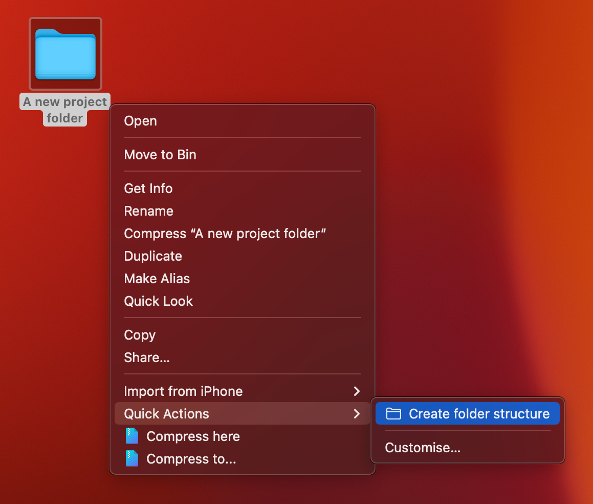
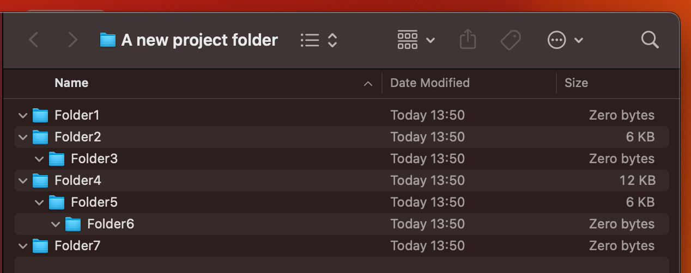

# Mac folder structure script for Automator

Do you need to repeatedly create the same folder structure for your new projects? This simple script for Apple Automator will save you time.


## Installation

1. simply download "Create folder structure.workflow.zip" and unzip it.  
2. right-click and choose Open With/Automator.  
3. change desired folder structure in the script ($1 is your project folder):  

 
```bash
mkdir -p "$1/Folder1"
mkdir -p "$1/Folder2/Folder3"
mkdir -p "$1/Folder4/Folder5/Folder6"
mkdir -p "$1/Folder7"
```
Save it and double-click the file. It will be installed into ~/Library/Services.
## Usage

Just create a folder for your new project, right-click on it, and choose "Quick Actions/Create folder structure".  



## Authors
Hope you find this script useful.
- [@Gondocz](https://www.github.com/gondocz)


## License

[](https://choosealicense.com/licenses/mit/)

